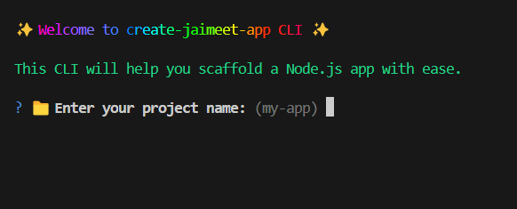
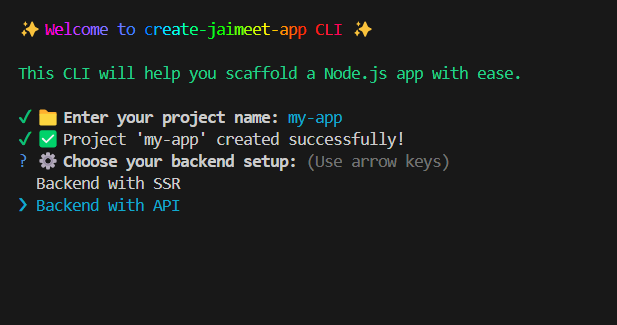

# ✨ create-jaimeet-app

[](https://www.npmjs.com/package/create-jaimeet-app)
[](https://github.com/jaimeetsingh22/create-jaimeet-app/blob/main/LICENSE)
[](https://www.npmjs.com/package/create-jaimeet-app)


A beautiful, beginner-friendly, and developer-focused CLI to **instantly generate Node.js + Fullstack boilerplates** — powered by **Express**, **React**, **Vite**, **MERN**, and **Next.js**.  
Made with ❤️ by [Jaimeet Singh](https://www.linkedin.com/in/jaimeet-singh-a594b62b0)

---

## 🚀 What It Does

Spin up a full-featured starter project with just one command!

- ✅ Clean folder structure
- ✅ Boilerplate code templates
- ✅ Pre-installed dependencies
- ✅ Built-in `npm` scripts (`dev`, `start`)
- ✅ Optional **Tailwind CSS** integration (for React/Vite)

Perfect for beginners and pros who want to skip the boring setup. 🔧

---

## 🧠 Available Templates

Choose from a growing set of templates:

- ⚛️ **React (JavaScript)**
- ⚛ **React (TypeScript)**
- 🔥 **MERN Stack (React + Express)**
- ▲ **Next.js** (via official `create-next-app`)
- 🛠️ **Backend API** (Express + MongoDB)
- 🗄️ **Server-side Rendering** (Express + EJS Views)

---

## 📦 Installation


Install globally using `npm`:
```bash
npm install -g create-jaimeet-app
```

Or use it directly with `npx`:

```bash
npx create-jaimeet-app
```

For development (after cloning this repository):

```bash
npm install
npm link
```

---

## 🧪 Usage

Run the CLI:

```bash
create-jaimeet-app
```
---
 ## You will be guided through the following:
```
📛 Entering your project name
🧱 Selecting your template (React, MERN, SSR, etc.)
🎨 Tailwind CSS setup (if applicable)
And boom 💥 — you're ready to code!
```
---
## 🗂️ Sample Folder Structure

```
my-app/
├── client/          # Frontend (React/Vite)
│   └── src/
├── server/          # Backend (Express/MongoDB)
│   ├── routes/
│   └── index.js
└── README.md
```
### Scripts included
```json
"scripts": {
  "start": "node index.js",
  "dev": "nodemon index.js"
}
```
## ⚙️ Dependencies Installed

- `express`
- `cors`
- `dotenv`
- `mongoose`

_For SSR setup only:_
- `ejs`
- `cookie-parser`
- `multer`
- `jsonwebtoken`

_Dev Dependency:_
- `nodemon`

## 🌈 CLI Preview 📸 
> CLI Preview  
 


> Next Step  



---
🤝 Need Help or Have a Feature Request? \
💬 DM me directly on LinkedIn
or open an Issue on GitHub.
---

## 🙋‍♂️ Author

**Jaimeet Singh**  
- GitHub: [@jaimeetsingh22](https://github.com/jaimeetsingh22)  
- LinkedIn: [Jaimeet Singh](https://www.linkedin.com/in/jaimeet-singh-a594b62b0)  
- Portfolio: [jaimeet-portfolio.vercel.app](https://jaimeet-portfolio.vercel.app)

---

## 🛡️ License

This project is licensed under the **ISC License**.

---

## 📢 Contributions

Pull requests and suggestions are welcome!  
Feel free to **fork** the repo and submit a **PR**.  
Let’s make open source more fun 🚀


Let me know if you want a version with badges (like npm version, license, etc.) or a `CONTRIBUTING.md` template to go with it!