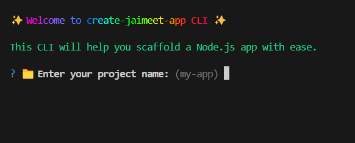
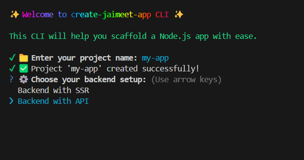

# 🛠️ create-jaimeet-app

A simple and interactive CLI tool to scaffold Node.js applications with either **SSR** or **API-based** backends — built by [Jaimeet Singh](https://github.com/jaimeetsingh22).


## ✨ Features

- 🌈 Beautiful and animated CLI using `chalk-animation`, `figlet`, and `nanospinner`
- 🔧 Choose between:
  - `Backend with API`
  - `Backend with SSR (EJS views)`
- 📁 Automatically creates project folders and boilerplate files
- 📦 Initializes `npm`, installs dependencies, and sets up scripts
- 💡 Graceful exit handling on `Ctrl + C` or CLI termination


## 🚀 Installation

Install globally using `npm`:

```bash
npm install -g create-jaimeet-app
```

Or use it directly with `npx`:

```bash
npx create-jaimeet-app
```

For development (after cloning this repository):

```bash
npm install
npm link
```

---

## 🧪 Usage

Run the CLI:

```bash
create-jaimeet-app
```

You will be guided through the following:

1. Enter your project name
2. Choose your backend type (`SSR` or `API`)
3. Let the CLI handle the setup for you!

---

## 📁 Project Structure (Example)

```
my-app/
├── config/
├── connections/
├── middlewares/
├── models/
├── public/
├── router/
├── views/           # Only for SSR projects
├── index.js
└── README.md
```

---

## 🧰 Scripts Added

```json
"scripts": {
  "start": "node index.js",
  "dev": "nodemon index.js"
}
```

---

## ⚙️ Dependencies Installed

- `express`
- `cors`
- `dotenv`
- `mongoose`

_For SSR setup only:_
- `ejs`
- `cookie-parser`
- `multer`
- `jsonwebtoken`

_Dev Dependency:_
- `nodemon`

---

## 📸 Preview

> CLI Preview  


> Next Step  


---

## 🙋‍♂️ Author

**Jaimeet Singh**  
- GitHub: [@jaimeetsingh22](https://github.com/jaimeetsingh22)  
- LinkedIn: [Jaimeet Singh](https://www.linkedin.com/in/jaimeet-singh-a594b62b0)  
- Portfolio: [jaimeet-portfolio.vercel.app](https://jaimeet-portfolio.vercel.app)

---

## 🛡️ License

This project is licensed under the **ISC License**.

---

## 📢 Contributions

Pull requests and suggestions are welcome!  
Feel free to **fork** the repo and submit a **PR**.  
Let’s make open source more fun 🚀


Let me know if you want a version with badges (like npm version, license, etc.) or a `CONTRIBUTING.md` template to go with it!