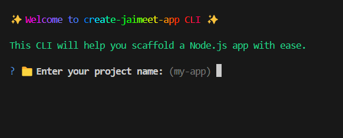
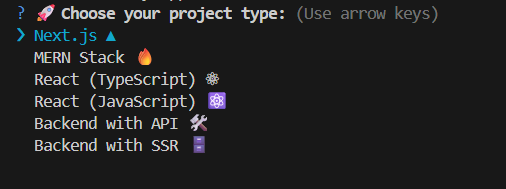

# ✨ create-jaimeet-app

[](https://www.npmjs.com/package/create-jaimeet-app)
[](https://github.com/jaimeetsingh22/create-jaimeet-app/blob/main/LICENSE)
[](https://www.npmjs.com/package/create-jaimeet-app)

A beautiful, beginner-friendly, and developer-focused CLI to **instantly generate Node.js + Fullstack boilerplates** — powered by **Express**, **GraphQL**, **React**, **Vite**, **MERN**, and **Next.js**. 

Made with ❤️ by [Jaimeet Singh](https://www.linkedin.com/in/jaimeet-singh-a594b62b0)

---

## 🚀 What It Does

Spin up a production-ready, full-featured starter project with just one command!

- ✅ **Clean Folder Structure:** Generates controllers, routes, middlewares, and connection folders.
- ✅ **Multi-Database Support:** Choose between **MongoDB** (Mongoose), **PostgreSQL / MySQL** (Sequelize ORM), or **MySQL Native** (raw mysql2 query support).
- ✅ **GraphQL & REST API:** Quickly bootstrap an **Express REST API**, an **Apollo GraphQL Standalone** server, or **Express + Apollo GraphQL**.
- ✅ **Frontend Excellence:** Instantly scaffold React (JS/TS) with optional **Tailwind CSS**, **Redux Toolkit**, and **React Router**.
- ✅ **Developer Experience:** Automatically initializes a Git repository, and generates custom `.env.example`, `.gitignore`, and dynamic `README.md` instructions tailored to your choices.
- ✅ **Zero Opinionated Models:** We intentionally leave out predefined database schemas so you have complete freedom to structure your application.

Perfect for beginners and pros who want to skip the boring setup. 🔧

---

## 🧠 Available Templates & Architecture

Choose from a growing set of highly customizable templates:

- ⚛️ **React (JavaScript / TypeScript)** 
  - Scaffolds using Vite. Prompts for Tailwind, Router, and Redux.
- 🔥 **MERN Stack (React + Node Backend)**
  - Frontend: Generates Vite React app with UI features.
  - Backend: Guides you to select between Express REST, GraphQL Standalone, or Express+GraphQL, and wires it to your database of choice.
- ▲ **Next.js** (via official `create-next-app`)
- 🛠️ **Backend API** 
  - Generates a standalone backend CLI wizard for GraphQL or REST configurations with your chosen database connection out of the box.
- 🗄️ **Server-side Rendering (SSR)** 
  - Express + EJS Views wired with your database and standard security middlewares.

---

## 📦 Installation

Install globally using `npm`:

```bash
npm install -g create-jaimeet-app
```

Or use it directly with `npx` (Recommended):

```bash
npx create-jaimeet-app
```

For development (after cloning this repository):

```bash
npm install
npm link
```

---

## 🧪 Usage

Run the CLI natively from your terminal:

```bash
create-jaimeet-app
```

---

## 🎛️ Interactive Setup Guide

When you run the tool, you will seamlessly be guided through:

1. **Entering your project name** (Creates normalized folder names).
2. **Selecting your template** (React, MERN, Backend SSR, etc.).
3. **Choosing Frontend Packages:** (Tailwind CSS, Redux, React-Router-DOM).
4. **Selecting Backend Architecture:** Do you prefer traditional REST API or GraphQL?
5. **Selecting Database:** Support for MongoDB, Sequelize (Postgres/MySQL), or Native MySQL.
6. **Automatic Configuration:** The CLI writes boilerplate files, customizes your `.env.example`, and initializes a `git` repository with your first commit!

And boom 💥 — you're ready to code!

---

## 🗂️ Sample Folder Structure (GraphQL + MongoDB example)

```text
my-app/
├── config/           # Configuration files
├── connections/      # Database connection (e.g. connectMongoDB.js)
├── middlewares/      # Express middlewares
├── graphql/          # GraphQL schema (typedef.js) & resolvers (resolver.js)
├── models/           # Database models (left empty for you to define)
├── .env.example      # Environment template dynamically shaped around your DB
├── .gitignore        # Generated Git ignore rules
└── index.js          # Entry point
```

### Scripts included dynamically based on your project:

```json
"scripts": {
  "start": "node index.js",
  "dev": "nodemon index.js"
}
```

---

## ⚙️ Dependencies Installed

Dependencies are installed dynamically based on your quiz responses:

**Always Included (Backend):**
- `express`
- `cors`
- `dotenv`
- `nodemon` (Dev)

**Database Connectors (Based on Choice):**
- MongoDB: `mongoose`
- PostgreSQL/MySQL: `sequelize`, `mysql2`, `pg`
- MySQL Native: `mysql2`

**GraphQL Support:**
- `@apollo/server`
- `@as-integrations/express5`

**SSR Support:**
- `ejs`, `cookie-parser`

---

## 🌈 CLI Preview 📸

> Setup Wizard
> 

> Ready to Code
> 

---

## 💡 SEO & Search Keywords
`create-jaimeet-app`, `nodejs boilerplate generator`, `fullstack react express cli`, `mern stack generator`, `scaffolding tool for nodejs`, `graphql server generator`, `apollo server cli`, `express sequelize boilerplate`, `mysql native nodejs`, `vite react tailwind redux setup`, `react boilerplate cli`

---

🤝 **Need Help or Have a Feature Request?**  
💬 DM me directly on LinkedIn or open an Issue on GitHub.

---

## 🙋‍♂️ Author

**Jaimeet Singh**

- GitHub: [@jaimeetsingh22](https://github.com/jaimeetsingh22)
- LinkedIn: [Jaimeet Singh](https://www.linkedin.com/in/jaimeet-singh-a594b62b0)
- Portfolio: [jaimeet-portfolio.vercel.app](https://jaimeet-portfolio.vercel.app)

---

## 🛡️ License

This project is licensed under the **ISC License**.

---

## 📢 Contributions

Pull requests and suggestions are welcome!
Feel free to **fork** the repo and submit a **PR**.
Let’s make open source more fun 🚀
